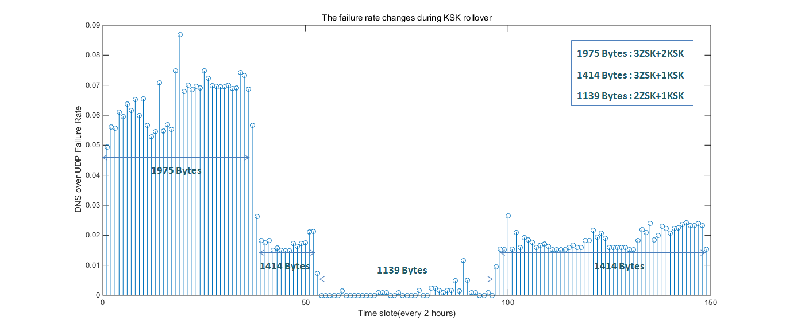

# Observation on Large response issue during Yeti KSK rollover


## Background

Yeti has successfully performed a KSK roll in 2016. During the first KSK rollover, it was discovered that a view added to a BIND 9 resolver did not use the same RFC 5011 timings as other views, including the default view. An administrator may expect that a BIND 9 resolver will handle RFC 5011 KSK rollover for all zones identically. The newly added views will fail to resolve when the KSK roll happens.It was documented in [a posts in Yeti blog.](http://yeti-dns.org/yeti/blog/2016/10/26/A-DNSSEC-issue-during-Yeti-KSK-rollover.html)


In order to add more information to the earlier roll, we performed [another KSK roll](https://github.com/BII-Lab/Yeti-Project/blob/master/doc/Experiment-KROLL2.md) before the ICANN KSK roll begins (2017-10-11). We used similar phases to the IANA roll, although with different timings so that we can finish the roll faster. Our "slots" will be 10 days long, and look like this:

|           |  slot 1  |  slot 2  |  slot 3  |  slot 4  |  slot 5  |  slot 6  |  slot 7  |  slot 8  |  slot 9  |
|-----------|----------|----------|----------|----------|----------|----------|----------|----------|----------|
| **19444** | pub+sign | pub+sign | pub+sign | pub+sign | pub+sign |   pub    |   pub    | revoke   |          |
|  **new**  |          |   pub    |   pub    |   pub    |   pub    | pub+sign | pub+sign | pub+sign | pub+sign |

As with the first KSK roll, the Yeti root KSK uses the RSA/SHA-256 algorithm with a 2048 bit key, the same as the IANA root KSK. Note that Yeti root ZSK uses 2048 bit key (RSA/SHA-256) as well.

In the design of Multi-ZSK, each Yeti DM used their own ZSK to sign the zone. That is to say at least 3 ZSKs are in the DNSKEY RRset, or more than 3 ZSKs (up to 6) due to ZSK rollover which may cause some overlap. Take the KSK rollover into consideration, it is possible that there are 8 keys (6 ZSK and 2 KSK) in DNSKEY RRset which will produce a very large response to the DNSEKY query with DO bit set. It is cool for yeti experiment looking for impacts of  large DNS response.

### Monitoring setup

Like we did in the first KSK roll, monitoring was set up on Yeti validating resolvers to capture validation failures. Besides DNSSEC validation, fragmentation and packet loss due to large DNS response are in question which Yeti was started to investigate. We set up RIPE Atlas measurements which are able to spot failures like timeout for DNSKEY queries via UDP.

For each Yeti server, a measurement was setup which ask for 100 IPv6-enabled probes from 5 regions, every 2 hours sending DNS query for DNSKEY via UDP with DO bit set.

The measurement API compatible specification is as follows:

```
curl --dump-header - -H "Content-Type: application/json" -H "Accept: application/json" -X POST -d '{
 "definitions": [
  {
   "target": "240c:f:1:22::6",
   "af": 6,
   "query_class": "IN",
   "query_type": "DNSKEY",
   "query_argument": ".",
   "use_macros": false,
   "description": "DNS measurement to 240c:f:1:22::6",
   "interval": 7200,
   "use_probe_resolver": false,
   "resolve_on_probe": false,
   "set_nsid_bit": false,
   "protocol": "UDP",
   "udp_payload_size": 4096,
   "retry": 3,
   "skip_dns_check": false,
   "include_qbuf": false,
   "include_abuf": true,
   "prepend_probe_id": false,
   "set_rd_bit": false,
   "set_do_bit": true,
   "set_cd_bit": false,
   "timeout": 5000,
   "type": "dns"
  }
 ],
 "probes": [
  {
   "tags": {
    "include": [
     "system-ipv6-works"
    ],
    "exclude": []
   },
   "type": "area",
   "value": "West",
   "requested": 20
  },
  {
   "tags": {
    "include": [
     "system-ipv6-works"
    ],
    "exclude": []
   },
   "type": "area",
   "value": "North-Central",
   "requested": 20
  },
  {
   "tags": {
    "include": [
     "system-ipv6-works"
    ],
    "exclude": []
   },
   "type": "area",
   "value": "South-Central",
   "requested": 20
  },
  {
   "tags": {
    "include": [
     "system-ipv6-works"
    ],
    "exclude": []
   },
   "type": "area",
   "value": "North-East",
   "requested": 20
  },
  {
   "tags": {
    "include": [
     "system-ipv6-works"
    ],
    "exclude": []
   },
   "type": "area",
   "value": "South-East",
   "requested": 20
  }
 ],
 "is_oneoff": false,
 "stop_time": 1501422358
}' https://atlas.ripe.net/api/v2/measurements//?key=YOUR_KEY_HERE

```

Given there are 25 servers, 25 RIPE Atlas measurements were set up during the rollover(from 2017-05-08 to 2017-05-25). Result files in JSON format were collected.

Note although each measurements ask for 100 IPv6 enabled probes to do the job, there are may lack of qualified probes in some regions. In most of case there are around 66 probes allocated for each measurement, which is acceptable for this experiment.

### Data analysis

The basic plan is to simply count the number of failures under different DNS response sizes during the experiment. Failure rate of each response size is the metric to measure if there is a correlation between failure rate and the DNS response size.

##### Simple Data pre-processing

Before the analysis is proceeded, some observation were made to filter bad samples and result.

* There are always a few probes found in each measurement failed all the time (>80% failure rate). They are labeled as a weak probes which are excluded for that measurement.
* There are two probes (prb_id: 17901, 12786) found weird in behavior, who reported timeout for small response(1139 octets) but works for large response (1975). They are excluded for all measurement.
* The are two measurements (msm_id: 8552432,8552458) reported far more failures and weak probes than other measurement. May be there are some routing problems on the path to these Yeti servers. So They are excluded for further analysis.

##### DNS response size

Although it is possible that there are 8 keys (6 ZSK and 2 KSK) in DNSKEY RRset and many possible combinations, during KSK rollover experiment we actually observed 4 cases:

* 3 ZSK and 2 KSK which produces DNSKEY response of 1975 octets;
* 3 ZSK and 1 KSK which produces DNSKEY response of 1414 octets;
* 2 ZSK and 1 KSK which produces DNSKEY response of 1139 octets;

WIDE rolls its ZSK every month. BII rolls its ZSK every two weeks. And TISF does not use its own Key but reuse WIDE ZSK instead. It is proved that during the measurements only BII rolled its key which overlapped with KSK rollover.

Note there are also other DNS response size were observed like 1419,1430,1143,1982 octets on other servers.

##### Counting Failures （timeout）

For every tome slot(2 hours) around 66 probes sent queries to Yeti root servers. We counted the number of failures and number of total queries which are categorized according to the packets size. The statistic is shown as following table.

| Packets size | number of failures| Number of total queries | Failure rate |
|--------------|-------------------|-----------------|--------------|
| 1139 | 274 |  64252 | 0.0042 |
| 1143  | 22 | 6949 | 0.0032  |
| 1414  | 3141 |  126951 |  0.0247 |
| 1419 |  113 | 13535 | 0.0083 |
| 1430 | 33 | 2255 |  0.0146 |
| 1975  | 2920 | 42529 | 0.0687 |


The following figure shows vividly the failure rate change during 1 KSK rollover and 2 ZSK rollovers (Note the monitoring was setup when two KSK were published). It experienced four periods: 2KSK+3ZSK, 1KSK+3ZSK, 1KSK+2ZSK, 1KSK+3ZSK.


Figure 1  Failure rate change during Yeti KSK rollover



### Conclusion

The monitoring result shows that statistically large packets will trigger higher failure rate (around 0.7%) due to IPv6 fragmentation issues, which accordingly increase probability of retries and TCP fallback. It should be noted that during the KSK rollover and other experience in Yeti testbed, no error report was spotted directly due to packet size problem (less than 1% likely to cause timeout). So it is should be further observed and evaluate the impact of large packets issue. To avoid less than 1% anomaly, we can consider is it worthwhile to take any measures to this issue? Does it sound like a plan to use stateful connection in the first place to transmit DNS like TCP or HTTP for queries causing large response, or [fragment the packets in the DNS layer](https://tools.ietf.org/html/draft-muks-dns-message-fragments-00)?.

